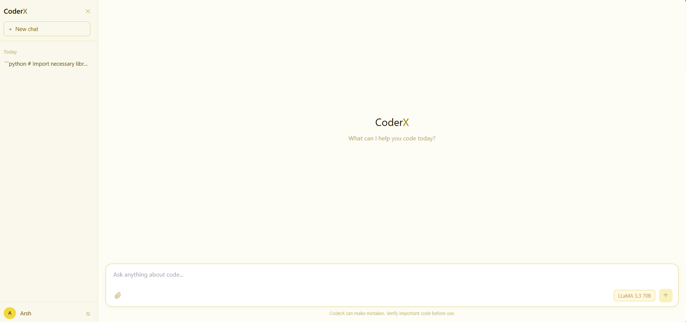
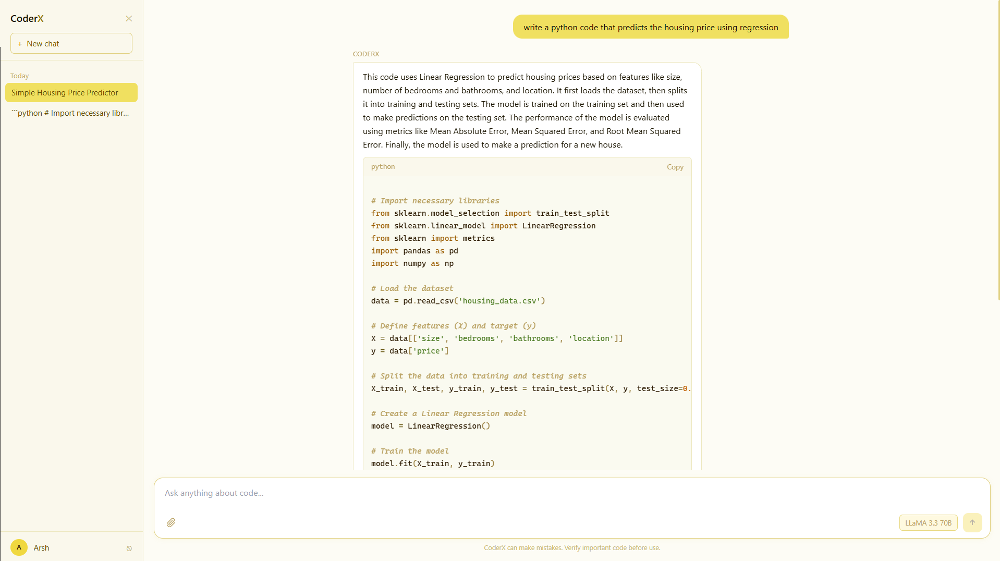

# CoderX

<p align="center">
  <h3 align="center">An AI coding assistant that generates, debugs, optimizes, and explains code through natural conversation.</h3>
</p>

<p align="center">
  <a href="https://coderx-seven.vercel.app/">
    
  </a>
  &nbsp;
  <a href="https://opensource.org/licenses/MIT">
    
  </a>
</p>

<p align="center">
  
  
  
  
  
</p>

---

## About CoderX

CoderX is a full-stack SaaS coding assistant built for developers who want fast, accurate AI help without leaving their workflow. It supports code generation, debugging, optimization, documentation, and code review — all through a chat interface. Guest users get 3 real AI responses before being prompted to sign up. Authenticated users get 15 messages per 5-hour window with full chat history.

---

## 📸 Screenshots

> Screenshots from the platform.

### Landing Page
<p align="center">

</p>

### Chat Interface
<p align="center">

</p>

### How chat would look like
<p align="center">

</p>

---

## Features

- Code generation — produces clean, commented code from natural language prompts across multiple languages
- Debugging — identifies syntax and logical errors, explains the root cause, and suggests fixes
- Optimization — improves time complexity, memory usage, and applies industry best practices
- Documentation — generates inline comments, function descriptions, and README content
- Code review — detects code smells, naming issues, and refactoring opportunities
- File upload with RAG — users can attach code files, PDFs, and text documents; content is extracted and injected into the model context
- Guest mode — unauthenticated users get 3 real AI responses (LLaMA 3.3 70B) before sign-up is required
- Chat history — each conversation is stored per user with auto-generated titles and sidebar navigation
- Rate limiting — 15 messages per 5-hour window per user, tracked server-side in PostgreSQL
- Security pipeline — prompt injection filtering and PII scrubbing run on every message before it reaches the model

---

## Tech Stack

### Frontend


### Backend


### AI


### Database


### Cloud


---

## 🏗️ Architecture

```text
[Browser]
   │
   └──► [Vercel — React + Vite]
              │
              └──► [Render — Express API]
                         ├──► [Supabase — PostgreSQL]
                         │      users · refresh_tokens · rate_limits
                         ├──► [MongoDB Atlas]
                         │      chats · messages
                         └──► [Groq API — LLaMA 3.3 70B]
```

---

## Security

Every user message passes through a four-stage pipeline before reaching the model:

```text
User message
   │
   ├──► Prompt injection filter (regex — blocks system prompt override attempts)
   ├──► PII scrubber (strips emails, phone numbers, card numbers)
   ├──► LLaMA 3.3 70B  (temperature 0.2, JSON mode enforced)
   └──► Output validator (schema check + confidence scoring)
```

Additional security measures:

- JWT access tokens signed with RS256, 15-minute TTL, stored in memory
- Refresh tokens stored in HTTP-only SameSite=Strict cookies with rotation on every use
- Token theft detection — reuse of a rotated token invalidates the entire token family
- Passwords hashed with bcrypt at cost factor 12
- Rate limiting enforced server-side in PostgreSQL — client cannot bypass it
- Guest rate limiting enforced per IP in-memory — 3 requests per hour
- CORS restricted to explicit origin, credentials mode enabled
- File uploads processed in memory — no files written to disk or stored externally
- Multer fileFilter blocks unsupported extensions before processing begins

---

## Getting Started

### Prerequisites

- Node.js 18+
- MongoDB Atlas account
- Supabase project
- Groq API key

### Installation

1. Clone the repository:
   ```bash
   git clone https://github.com/mohdarsh786/coderx.git
   cd coderx
   ```

2. Install server dependencies:
   ```bash
   cd server
   npm install
   ```

3. Install client dependencies:
   ```bash
   cd ../client
   npm install
   ```

4. Set up environment variables:
   ```bash
   cp .env.example server/.env
   # Fill in the values listed in the Environment Variables section below
   ```

5. Set up the Supabase tables — refer to the private schema documentation.

6. Run both servers:
   ```bash
   # Terminal 1
   cd server
   npm run dev

   # Terminal 2
   cd client
   npm run dev
   ```

---

## Environment Variables

### Server (`server/.env`)

| Variable | Description |
|----------|-------------|
| `PORT` | Port the Express server runs on (default: 5000) |
| `NODE_ENV` | `development` or `production` |
| `CLIENT_URL` | Frontend URL for CORS (e.g. `http://localhost:5173`) |
| `JWT_ACCESS_SECRET` | 64-character random string for signing access tokens |
| `JWT_REFRESH_SECRET` | 64-character random string for signing refresh tokens |
| `ACCESS_TOKEN_TTL` | Access token expiry (default: `15m`) |
| `REFRESH_TOKEN_TTL` | Refresh token expiry (default: `7d`) |
| `SUPABASE_URL` | Supabase project URL |
| `SUPABASE_SERVICE_KEY` | Supabase service role key (not the anon key) |
| `MONGO_URI` | MongoDB Atlas connection string |
| `GROQ_API_KEY` | from groq.com
| `GROQ_MODEL` | Model name — `llama-3.3-70b-versatile` |

### Client (`client/.env`)

| Variable | Description |
|----------|-------------|
| `VITE_API_URL` | Backend API URL (e.g. `http://localhost:5000`) |

Generate JWT secrets with:
```bash
node -e "console.log(require('crypto').randomBytes(64).toString('hex'))"
```

---


## Rate Limiting

CoderX enforces two independent rate limiting tiers.

Guest tier — 3 requests per IP per hour, tracked in memory. On the 4th request the server returns `429` with `{ signInRequired: true }`.

Authenticated tier — 15 messages per 5-hour rolling window per user, tracked in PostgreSQL. On the 16th request within the window the server returns `429` with `{ resetAt: <ISO timestamp>, waitMs: <milliseconds> }`. The frontend displays a live countdown timer and disables the input until the window resets.

---

## Project Structure

```text
CoderX/
├── client/                  # React + Vite frontend
│   └── src/
│       ├── components/
│       │   ├── auth/        # Login and signup forms
│       │   ├── chat/        # ChatWindow, MessageList, MessageInput, QuotaBar
│       │   ├── landing/     # Landing page sections
│       │   ├── layout/      # Sidebar
│       │   └── ui/          # CodeBlock, Avatar, reusable elements
│       ├── hooks/           # useAuth, useChat, useQuota, useGuest
│       ├── pages/           # Landing, Chat, Login, Signup, NotFound
│       ├── services/        # API call functions (auth, chat, upload)
│       └── store/           # Zustand slices (auth state)
│
└── server/                  # Node.js + Express backend
    └── src/
        ├── config/          # Supabase client, MongoDB connection, Multer config
        ├── controllers/     # Route handlers (auth, chat, ai, user)
        ├── middleware/      # JWT auth, rate limiting, error handling
        ├── models/          # MongoDB schemas (Chat, Message)
        ├── pipeline/        # Prompt guard, PII scrub, Groq client, output validator
        ├── routes/          # Express routers
        └── services/        # Business logic (auth, token, chat, AI, rate limit)
```

---

## Author

Built by **Mohd. Arsh** — [](https://github.com/mohdarsh786)

contact details: In profile

---

## 📄 License

This project is licensed under the [MIT License](https://opensource.org/licenses/MIT).
